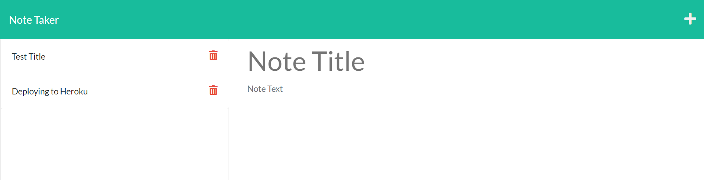
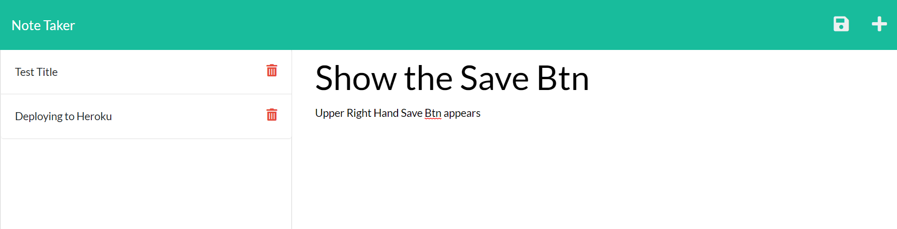

# NotMyNoteTaker

## Description
Project was to create a Note Taker, that would save notes and delete them as needed
- To be able to have a site that tracks items to do and notes to refer back to
- Give me experience with express
- Having to manually track any notes to take
- How to use express, how to do modular routing

# Table of Contents
If your README is long, add a table of contents to make it easy for users to find what they need.
- [Installation](#installation)
- [Usage](#usage)
- [Contributions](#contributions)
- [License](#license)
- [Questions](#questions)

## Installation
What are the steps required to install your project? Provide a step-by-step description of how to get the development environment running.

## Usage
Please see screenshots attached

    
## Contributions
The following persons assisted with this project.  If left blank, there were no other contributors.
- Github Repository:    https://github.com/DeeScrump/NotMyNoteTaker.git
- Live Deployment Sit:  https://notmynotetaker.herokuapp.com/

## License
© <2021> Dwight C Kornbluth II

      Permission is hereby granted, free of charge, to any person obtaining a copy of this software and associated documentation files (the "Software"), to deal in the Software without restriction, including without limitation the rights to use, copy, modify, merge, publish, distribute, sublicense, and/or sell copies of the Software, and to permit persons to whom the Software is furnished to do so, subject to the following conditions:

      The above copyright notice and this permission notice shall be included in all copies or substantial portions of the Software.
      
      THE SOFTWARE IS PROVIDED "AS IS", WITHOUT WARRANTY OF ANY KIND, EXPRESS OR IMPLIED, INCLUDING BUT NOT LIMITED TO THE WARRANTIES OF MERCHANTABILITY, FITNESS FOR A PARTICULAR PURPOSE AND NONINFRINGEMENT. IN NO EVENT SHALL THE AUTHORS OR COPYRIGHT HOLDERS BE LIABLE FOR ANY CLAIM, DAMAGES OR OTHER LIABILITY, WHETHER IN AN ACTION OF CONTRACT, TORT OR OTHERWISE, ARISING FROM, OUT OF OR IN CONNECTION WITH THE SOFTWARE OR THE USE OR OTHER DEALINGS IN THE SOFTWARE.
      

https://opensource.org/licenses/MIT

## Questions
- https://github.com/DeeScrump

If any questions, please direct them directly to me at dwight.kornbluth@gmail.com
